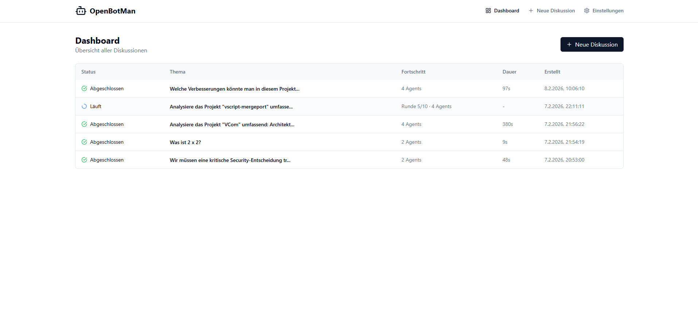

# 🤖 OpenBotMan

**Multi-Agent Konsens-Diskussionen mit KI**

[](https://opensource.org/licenses/MIT)
[](https://www.typescriptlang.org/)

---

## Was ist OpenBotMan?

OpenBotMan orchestriert mehrere KI-Agenten für strukturierte Diskussionen mit **automatischem Konsens-Protokoll**. Jeder Agent hat eine Rolle und Expertise - zusammen finden sie die beste Lösung.

```
Du: "Monolith oder Microservices für unser Startup?"

OpenBotMan koordiniert 4 Experten:

  🎯 Strategic Planner    → "Für 3 Entwickler empfehle ich..."
  💻 Senior Developer     → "Technisch gesehen sollten wir..."
  🔬 Research Analyst     → "Studien zeigen dass..."
  🔍 Security Expert      → "Aus Sicherheitssicht..."

📊 Runde 1: CONCERN von Developer → Keine Einigung
📊 Runde 2: Alle SUPPORT → ✅ KONSENS ERREICHT!

→ Ergebnis als Markdown gespeichert
```

---

## ✨ Features

| Feature | Status |
|---------|--------|
| Multi-Agent Diskussionen | ✅ |
| Konsens-Protokoll (SUPPORT/CONCERN/OBJECTION) | ✅ |
| Multi-Provider (Claude, Gemini, Ollama, LM Studio) | ✅ |
| Web-UI Dashboard | ✅ |
| VSCode Extension | ✅ |
| Job Persistenz (überlebt Neustarts) | ✅ |
| Parallele Diskussionen | ✅ |
| Agent Teams (quick, full, security, etc.) | ✅ |
| Per-Agent Model/Provider | ✅ |

---

## 🚀 Quick Start

### Voraussetzungen

- Node.js 20+ 
- pnpm 8+
- Mindestens ein LLM Provider:
  - **Kostenlos/Lokal:** Ollama oder LM Studio
  - **Claude Pro-Abo:** Unlimited via Claude CLI (empfohlen!)
  - **Cloud APIs:** Claude API, Google AI, OpenAI (pay-per-token)

### Installation

```bash
# Klonen
git clone https://github.com/vbdata-source/OpenBotMan.git
cd OpenBotMan

# Installieren
pnpm install

# Konfigurieren
cp config.example.yaml config.yaml
cp .env.example .env
# → API Keys in .env eintragen

# Bauen
pnpm build
```

### Starten

```bash
# API Server (Port 8080)
pnpm api

# Web UI (Port 3000) - in neuem Terminal
pnpm web

# Öffne http://localhost:3000
```

### CLI Nutzung

```bash
# Einfache Diskussion
pnpm cli discuss "Wie implementiere ich Caching?"

# Mit spezifischem Team
pnpm cli discuss "Security Review" --team security

# Mit Dateien als Kontext
pnpm cli discuss "Review diesen Code" --files src/auth.ts,src/api.ts

# Weniger Agents (schneller)
pnpm cli discuss "Schnelle Frage" --agents 2

# Verbose Output
pnpm cli discuss "Thema" --verbose
```

---

## 🖥️ Web-UI

Das Web-UI bietet eine graphische Oberfläche für Diskussionen:

- **Dashboard** - Übersicht aller Jobs
- **Neue Diskussion** - Team auswählen, Thema eingeben
- **Job-Ansicht** - Live-Status, Agent-Fortschritt, Ergebnis



**Start:** `pnpm api` + `pnpm web` → http://localhost:3000

---

## 🔧 VSCode Extension

Volle Integration direkt in der IDE!

### Befehle & Shortcuts

| Shortcut | Befehl | Beschreibung |
|----------|--------|--------------|
| `Ctrl+Shift+O` | Experten fragen | Neue Diskussion mit Team-Auswahl |
| `Ctrl+Shift+R` | Code Review | Review der aktuellen Datei |
| `Ctrl+Shift+Alt+O` | Projekt analysieren | Ganzes Projekt analysieren |
| - | Status prüfen | API-Server Verbindung testen |
| - | Server starten | API-Server aus VSCode starten |

### Features

- **Team-Auswahl** - Quick-Pick mit allen konfigurierten Teams
- **Live-Status** - Agent-Fortschritt in Echtzeit sehen
- **Auto-Save** - Ergebnisse als Markdown im Projekt speichern
- **Activity Bar** - Sidebar mit aktiven Jobs
- **Verbose-Levels** - 0=Nur Ergebnis, 1=Live-Updates, 2=Thinking

### Einstellungen

| Setting | Default | Beschreibung |
|---------|---------|--------------|
| `openbotman.apiUrl` | `http://localhost:8080` | API Server URL |
| `openbotman.apiKey` | - | API Key |
| `openbotman.timeoutMinutes` | 60 | Job-Timeout |
| `openbotman.verboseLevel` | 1 | 0/1/2 (Details oben) |
| `openbotman.autoSaveResults` | true | Auto-Speichern |
| `openbotman.discussionsPath` | `discussions` | Speicher-Ordner |

### Installation

```bash
cd C:\Sources\OpenBotMan
pnpm build
cd packages\ide-vscode
pnpm run compile && npx vsce package --no-dependencies
```

Dann in VSCode: `Ctrl+Shift+P` → "Install from VSIX" → `.vsix` auswählen

---

## ⚙️ Konfiguration

### config.yaml

```yaml
# Agenten definieren
agents:
  - id: planner
    name: "Strategic Planner"
    emoji: "🎯"
    role: "architect"
    provider: google
    model: gemini-2.0-flash
    systemPrompt: "Du bist ein erfahrener Software-Architekt..."

  - id: developer
    name: "Senior Developer"
    emoji: "💻"
    role: "coder"
    provider: ollama
    model: qwen3-coder:30b

# Teams (Agent-Gruppen)
teams:
  - id: quick
    name: "Schnelle Analyse"
    agents: [planner, developer]
    
  - id: full
    name: "Volles Team"
    agents: [planner, developer, analyst, security]
    default: true

# Diskussions-Einstellungen
maxRounds: 10
timeout: 60
```

### .env

```bash
# Cloud Provider (optional)
GOOGLE_API_KEY=your-key
ANTHROPIC_API_KEY=your-key
OPENAI_API_KEY=your-key

# API Server
OPENBOTMAN_API_KEYS=local-dev-key
```

---

## 🤖 Unterstützte Provider

| Provider | Typ | Kosten | Konfiguration |
|----------|-----|--------|---------------|
| `claude-cli` | Claude Pro-Abo | ~$20/Monat, unlimited | [Claude CLI](https://docs.anthropic.com/en/docs/claude-cli) installieren |
| `claude-api` | Claude API | Pay-per-token | `ANTHROPIC_API_KEY` |
| `google` | Gemini API | Pay-per-token | `GOOGLE_API_KEY` |
| `openai` | OpenAI API | Pay-per-token | `OPENAI_API_KEY` |
| `ollama` | Lokal | Kostenlos | [Ollama](https://ollama.ai) installieren |
| `openai` + `baseUrl` | Lokal | Kostenlos | LM Studio, vLLM, etc. |

**Empfehlung:** Claude Pro-Abo (`claude-cli`) für unbegrenzte Nutzung, kombiniert mit lokalen Modellen (Ollama) für schnelle/günstige Agents.

---

## 📊 Konsens-Protokoll

Jeder Agent muss seine Position am Ende angeben:

| Position | Bedeutung |
|----------|-----------|
| `PROPOSAL` | Erster Vorschlag (nur Runde 1) |
| `SUPPORT` | Volle Zustimmung |
| `SUPPORT_WITH_CONDITIONS` | Zustimmung mit Bedingungen |
| `CONCERN` | Bedenken, aber kein Veto |
| `OBJECTION` | Blockiert Konsens |

**Konsens erreicht wenn:**
- Kein `OBJECTION`
- Mindestens ein `SUPPORT` oder `SUPPORT_WITH_CONDITIONS`

---

## 📁 Projekt-Struktur

```
OpenBotMan/
├── packages/
│   ├── cli/           # Command Line Interface
│   ├── api-server/    # HTTP API (Port 8080)
│   ├── web-ui/        # React Dashboard (Port 3000)
│   ├── orchestrator/  # Kern-Logik, Provider
│   ├── ide-vscode/    # VSCode Extension
│   └── protocol/      # Shared Types
├── config.yaml        # Haupt-Konfiguration
├── .env              # API Keys (nicht committen!)
└── data/
    └── jobs.json     # Persistierte Jobs
```

---

## 🛠️ Entwicklung

```bash
# Alle Packages bauen
pnpm build

# Einzelnes Package bauen
pnpm --filter @openbotman/api-server build

# Dev-Modus (mit Watch)
pnpm --filter @openbotman/api-server dev
```

---

## 🗺️ Roadmap

Siehe [docs/FUTURE-IDEAS.md](docs/FUTURE-IDEAS.md) für alle geplanten Features.

**Nächste Schritte:**

- [ ] Settings-Seite in Web-UI (graphischer Config-Editor)
- [ ] WebSockets für Real-time Updates (aktuell: Polling)
- [ ] Globales `openbotman` CLI Command

**Später:**

- [ ] Web-Recherche Integration
- [ ] Docker Deployment
- [ ] Knowledge Base

---

## 📜 Lizenz

MIT License - siehe [LICENSE](LICENSE)

---

## 🙏 Credits

- [Anthropic](https://anthropic.com) - Claude
- [Google](https://ai.google.dev) - Gemini
- [Ollama](https://ollama.ai) - Lokale LLMs
- [OpenClaw](https://openclaw.ai) - Inspiration

---

<div align="center">

**Built with ❤️ by [vb-data e.U.](https://vb-data.at)**

</div>
